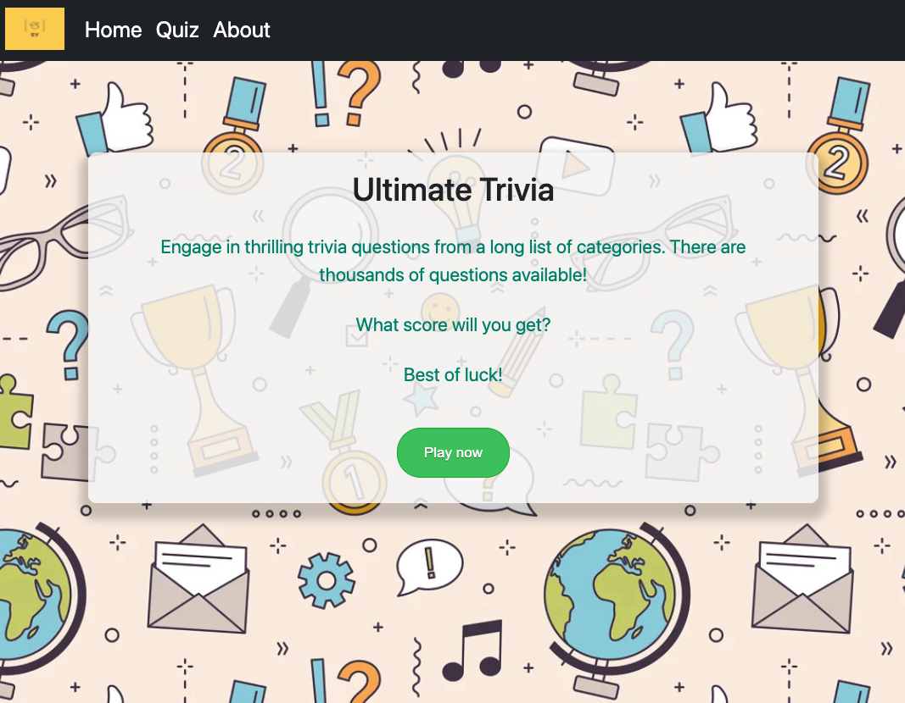
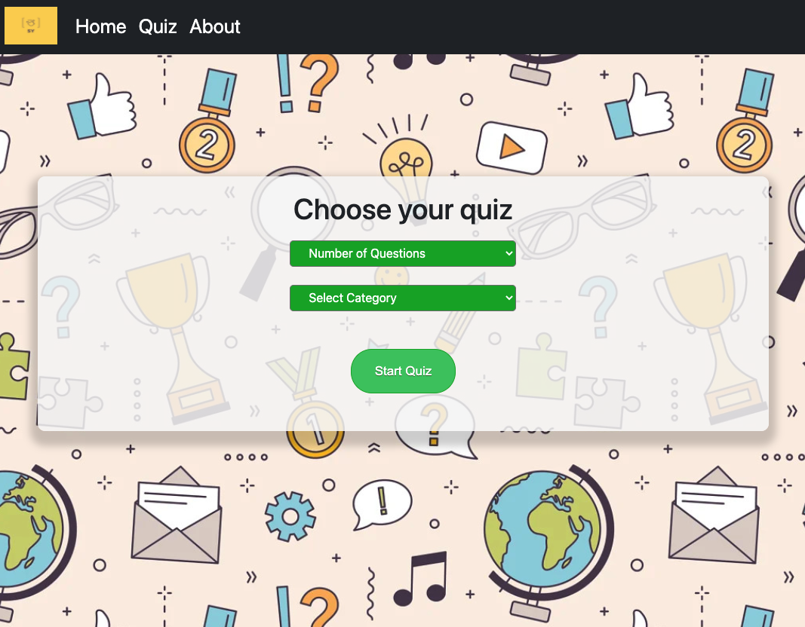
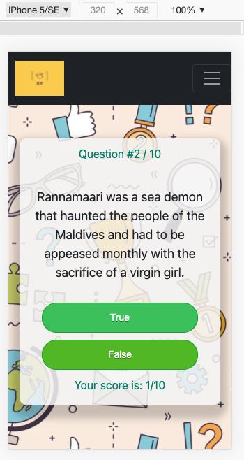

###  General Assembly, Software Engineering Immersive

# Quiz App - Project 2


## Overview
Quiz App was created as part of a 48 hour paired hackathon. My partner and I created a trivia quiz app using data fetched from an <a href="http://opentdb.com">external API</a>. We thought that it could provide a source of entertainment for people during the Covid-19 epidemic.


[Click here to use the app.](https://yusuf963.github.io/quiz/#/asdfasdf)


### Project Brief
* Build a React application that consumes a public API.
* The app should have several components and include a router with several "pages".
* Be deployed online and accessible to the public.


### Technologies used
* React & React Router DOM
* CSS
* ES6 JavaScript
* Bootstrap & React Bootstrap
* Git
* Webpack


## Setting the Foundations
We started out by researching a number of APIs and quickly decided on a quiz API because of the variety of endpoints available, giving us wide scope to build features and functionality. We drew up a wireframe of the app and discussed user features, organising and prioritising them accordingly.

We used React Router DOM to create routes to various parts of the app and implemented a redirect in case of user error:

```
const App = () => (
  <HashRouter>
    <Switch>
      <Route path="/quiz/home" component={HomePage} />
      <Route path="/quiz/quiz" component={Quiz} />
      <Route path="/quiz/about" component={About} />
      <Redirect to="/quiz/home" />
    </Switch>
  </HashRouter>
)
```


## Getting data
Two API calls are made, one to receive a web token and the other to get quiz data using this token. We used template literals to pass the user’s chosen quiz categories into the latter API call.

```
  useEffect(() => {
    fetch('https://opentdb.com/api_token.php?command=request')
      .then(result => result.json())
      .then(result => setToken(result.token))
      .catch((err) => {
        alert(err, 'token cannot be found')
      })
  },[])

  function runApi() { 
    return new Promise(function(resolve, reject) { 
      fetch(`https://opentdb.com/api.php?amount=${questionNumber}&${!category ? '' : 'category'}=${category}&encode=base64&token=${token}`)
        .then(data => data.json())
        .then((response) => { 
          resolve(updateDisplayQuestion(response.results))
        }, 
        (error) => { 
          reject(console.log(error, 'Error making API call'))
        })
    }) 
  }

```


## Quiz functionality
Quiz logic was planned out, and we had created various pieces of state to keep track of game progress. To display questions, we would amalgamate correct and incorrect answers from the API’s response in an array, keeping track of the correct answer’s index. The array would then be shuffled, mapped over and displayed to the user via buttons. The questions came encoded in base-64 which we needed to convert using ```atob()```.

```
let shuffled = [displayQuestion[currentQuestion].correct_answer]
    displayQuestion[currentQuestion].incorrect_answers.map((element) => {
      shuffled.push(element)
    })

    shuffled = shuffled.map((a) => ({ sort: Math.random(), value: a }))
      .sort((a, b) => a.sort - b.sort)
      .map((a) => a.value) 

    correctIndex = shuffled.indexOf(displayQuestion[currentQuestion].correct_answer)
```

A function would check which button had been pressed, incrementing the score accordingly. We also kept track of the previous answer in order to display a fade out CSS animation showing whether an answer had been answered correctly.

```
function checkAnswer(input){
    setCurrentQuestion(currentQuestion + 1)
    if (input === correctIndex){
      updateScore(score + 1)
      setPreviousAnswer(true)
    } else {
      setPreviousAnswer(false)
    }
  }
```

The animated element was displayed with the mapping of questions/answers which were displayed as follows:

```
<p>Question #{currentQuestion + 1} / {displayQuestion.length}</p>
    <div className='currentquestion'>{atob(displayQuestion[currentQuestion].question)}</div>
    {(previousAnswer === false) && <p className='animated fadeOut isWrong'>WRONG</p>}
    {(previousAnswer === true) && <p className='animated fadeOut isCorrect'>CORRECT</p>}
    {shuffled.map((element, index) => {
      return <div className='anwsers-container' key={index}>
        <button id={index} className='questionBtn' value={index} onClick={()=> checkAnswer(index)}>
          {atob(element)}
        </button>
      </div>
    })}
```


## Challenges
* Questions are shuffled after the aforementioned animation is shown, leading to an awkward experience. This is likely due to setting state in the wrong part of the app’s quiz component.
* The API has several endpoints that we were keen to utilize for added quiz customisation, however, we were primarily constrained by the amount of data given back, sometimes returning as little as three trivia questions to work with. We tried several solutions such as aggregating multiple API calls using ```Promise.all``` and making requests using multiple web tokens, but we did not receive adequate data back. This meant that we had to strip down some of the quiz selection functionality.


If you have spotted any additional bugs, please let me know by [email.](mailto:stefansokolowski16@gmail.com)


## Achievements
* Collaborating and working well together as a team.
* Using React Router DOM to create a seamless transition between pages.
* Using Bootstrap and React Bootstrap for the first time to create responsive mobile design.
* This was my first time researching and using asynchronous JavaScript.


## Key learnings
* My first pair-programming experience taught me a lot about teamwork and collaboration.
* Transitioning from Vanilla Js to React forced me to think in a different way about coding, opening my eyes to all of React’s possibilities.
* Working in React for the first time taught me about building an app with components. Breaking code up into separate components made things more organised and easier to debug.


## Features I'd like to implement
* Two player mode
* Added user selection
* Saving and displaying high-scores with ```localStorage```


## The finished product







